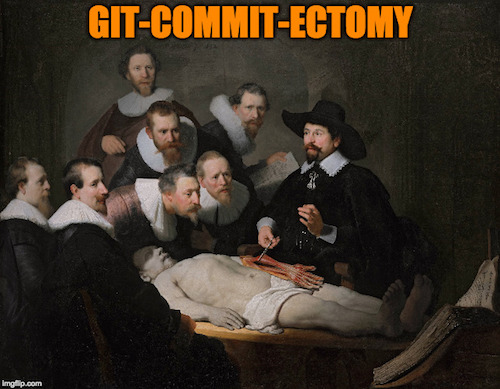

# git-commit-ectomy

Perform a git-commit-ectomy to forever remove problematic commits from your repo history.

This uses the [git-forget-blob.sh](https://tinyurl.com/git-commit-ectomy) script from [@nachoparker](https://github.com/nachoparker).



## what is this

This page covers how to perform a git-commit-ectomy.
This is a procedure that removes problematic files or
commits from your repository history. 

For example, suppose the intern adds and commits a 1 GB 
CSV file to your repository. After profusely apologizing,
the intern removes the 1 GB file, but the damage is done,
and the 1 GB file will forever bloat `.git`.

Enter the git surgeon. A git surgeon can remove such 
problematic commits and get the commit history back in 
shape.

[Visit the Git College of Surgery on Github](https://github.com/git-college-of-surgery)

## the procedure

This surgical procedure can happen one of three ways:

* Git-Commit-Ectomy the Easy Way: [Single Branch](easy.md)

* Complications: [Dealing with Branches](branches.md)

* Git-Commit-Ectomy the Hard Way: [Cherry Picking](cherrypicking.md)

* Oh F&!k: [Please Send Backup](ohfk.md)


# consult with your doctor

You should consult with your doctor to determine if a 
git-commit-ectomy is right for your repository.

This one-liner lists the 40 largest files in the repo
(modify the `tail` line to change the number of items
returned):

```
$ git rev-list --all --objects | \
     sed -n $(git rev-list --objects --all | \
     cut -f1 -d' ' | \
     git cat-file --batch-check | \
     grep blob | \
     sort -n -k 3 | \
     \
     tail -n40 | \
     \
     while read hash type size; do
          echo -n "-e s/$hash/$size/p ";
     done) | \
     sort -n -r -k1 
```

